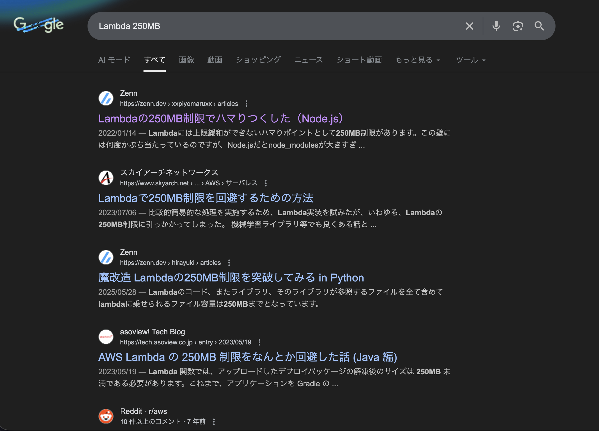
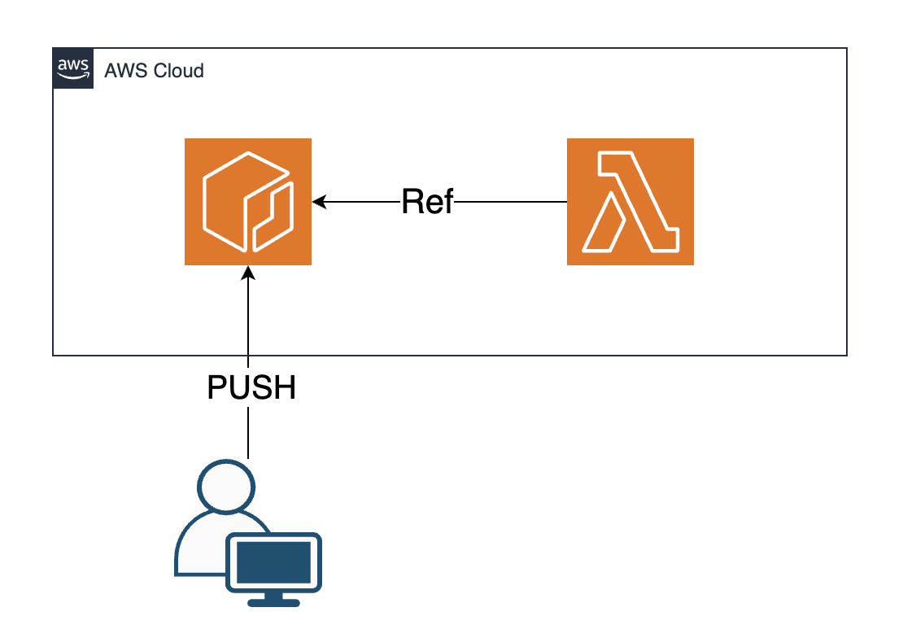

<!-- _class: title -->

# ここが辛いよLambda

2026/02/19
JAWS-UG神戸#10
髙橋　透

---
<style scoped>
section {
  justify-content: flex-start;
}
</style>


### 髙橋　透@tttol777
- Role: Application Engineer
- Like: Java / AWS
- Others: 一児の父
### Works
- Web: https://about-tttol.link/
- SpeakerDeck: https://speakerdeck.com/tttol

---
# 今回のLTの背景
- 業務で2ヶ月くらい集中してLambdaを使った開発の機会があった
- 今までなんとなくでLambdaを使ってたが、商用環境でガッツリ使うことで色々わかった
- **Lambdaを使って感じた辛いところ・注意点を共有します**

---

# 今日話すこと

1. **250MBクォータ** の壁
2. **SAM or IaC** の選択

---

<!-- _class: title -->
# 250MBクォータ

---

# 250MBクォータとは

- Lambda関数には**容量の上限**がある
- 関数本体 + Lambda Layer = **合計250MBまで**
- 超過すると...

```
Unzipped size must be smaller than 262144000 bytes
```

---

# 250MBって足りるの？

- 小〜中規模の実装なら十分足りる
- しかし**依存ライブラリ**を含めると話が変わる

 例: Oracle DB向けのコネクションライブラリを入れたら**約300MB**まで膨れ上がった

---

<style scoped>
section {
  text-align: center;
}
</style>

「Lambda 250MB」で検索すると困っている人が多数


---

# 250MBを超えたらどうする？

選択肢は2つ

| | 方法 | 向いているケース |
|---|---|---|
| ① | リソースを削って250MB未満にする | ちょっとだけ超過（〜255MB） |
| ② | **コンテナイメージ方式**に切り替える | 大幅に超過（300MB〜） |

---

# コンテナイメージ方式

2020年12月リリースの機能
関数をDockerイメージとしてビルド → **ECRにPUSH**



---

# コンテナイメージ方式のメリット
イメージサイズは**最大10GB**まで許容
→zipスタイルの**40倍！**

---

# 注意点

途中からの切り替えは**大変**

- SAM/CDKの設定ファイルを大幅に書き直し
- ECRに関するIAMポリシーが色々必要


→**構築初期の段階から見極めることが重要**

---

<!-- _class: title -->
# SAM or IaCの選択

---
# SAM or IaCの選択

Lambdaのデプロイ方法はいくつかある

| 方法 | 特徴 |
|---|---|
| **AWS SAM CLI** | サーバーレス向けに特化cfn |
| **AWS CDK / Terraform** | 王道のIaC |

---

# SAMの採用

- Lambda関数1個のために CDK/Terraform は大掛かり
- SAMなら `sam build` → `sam deploy` でシンプル
- 設定ファイルも `template.yaml` と `samconfig.toml` だけ

初めて使ったが、中々便利だった

---

# SAMの辛かったところ

## 認知度の低さ

- チーム内で「聞いたことあるけどよく知らない」が多数
- 認知度が低いと...
  - 引き継ぎ時のコスト増
  - インフラチームへの依頼時にも説明コスト増

---

# どうすればよかったか

## チーム内で実績のあるIaCに寄せる

- チーム内ではTerraformが使われている箇所があった
- **Terraformにしておけばよかった**と後悔
- 技術的に最適な選択 ≠ チームにとって最適な選択

---

# まとめ

1. **250MBクォータに気をつけろ**
   - 構築前に依存ライブラリの容量を見積もる
   - zip or コンテナイメージは事前に決める

2. **デプロイ手法はチームで考えて選定しよう**
   - 認知されていないツールは説明コストが上がる
   - チーム内の既存技術に寄せるのも大事

---

# 余談
この資料はMarpで作りました
https://github.com/marp-team/marp-cli

---

<!-- _class: title -->
# ありがとうございました
